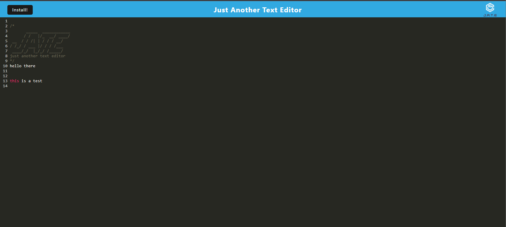
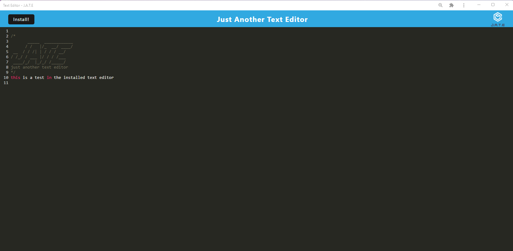

# text-editor-pwa

A PWA text editor

## Description

This text editor is a Progressive Web App Text Editor, (PWA for short). The app allows the user to install and use the text editor offline. It uses webpack.config, manifest.json, service-worker(s), IndexedDB Storage as well for storing and retrieving the entered text. When the user goes to the application in the browser they will see a text editor UI (User Interface). The user can type text into the editor, click at the top of the page banner, or enter on their keyboard and the text will save to the IndexedDB. If user refreshes it will get the IndexedDB from the IDB (Indexed Data Base). The user can also install the application for use outside the browser and offline since the application caches. The user can download this repository and run it by using the node command "npm run build" and "npm start".

## Screenshot(s)

Application in the browser window

Application installed locally

## Link to Deployed App

[Link to deployed app](https://enigmatic-sands-32378.herokuapp.com/)
